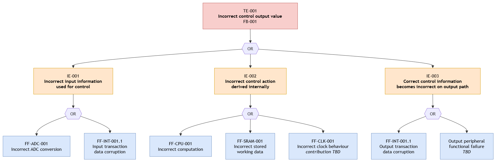

# Qualitative Fault Tree Analysis

**Version:** v0.1 — Work in Progress

## 1. Objective

This analysis examines one MCU boundary failure top-down:

**TE-001 — Incorrect control output value is presented by the MCU/SoC toward the external power stage (`FB-001`).**

The tree is qualitative. No event probabilities are assigned.

## 2. Fault Tree

*Figure 1 — Preliminary qualitative fault tree for `TE-001`.*

The top-level OR gate indicates that any of the identified branches may potentially contribute to `TE-001`.

The current tree represents functional failure paths only. Safety-mechanism failures and dependent failures are not yet incorporated.

## 3. Branch Traceability

| Intermediate Event | Description | Functional Failure |
|---|---|---|
| IE-001 | Incorrect feedback information used for control | FF-ADC-001 |
| IE-002 | Incorrect control computation | FF-CPU-001 |
| IE-003 | Incorrect working data used for computation | FF-SRAM-001 |
| IE-004 | Control information corrupted during transfer | FF-INT-001.1 |
| IE-005 | Incorrect output generation | TBD |

The functional failures are defined in the [Functional Failure Analysis](../failure-analysis/functional_failure_analysis.md).

## 4. Findings

The preliminary tree identifies several internal paths that may lead to the same MCU boundary failure.

`TE-001` therefore cannot be attributed to a single IP solely from the externally observed incorrect control value.

The output-peripheral branch remains TBD because its functional failure analysis has not yet been developed.

The tree will require refinement when safety-mechanism failures and dependent failures are introduced.

## 5. Open Items

- refine intermediate events as the architecture matures;
- analyse the output-peripheral branch;
- introduce safety-mechanism failure events;
- evaluate dependent/common-cause contributors; and
- perform quantitative analysis only if justified semiconductor failure data become available.
